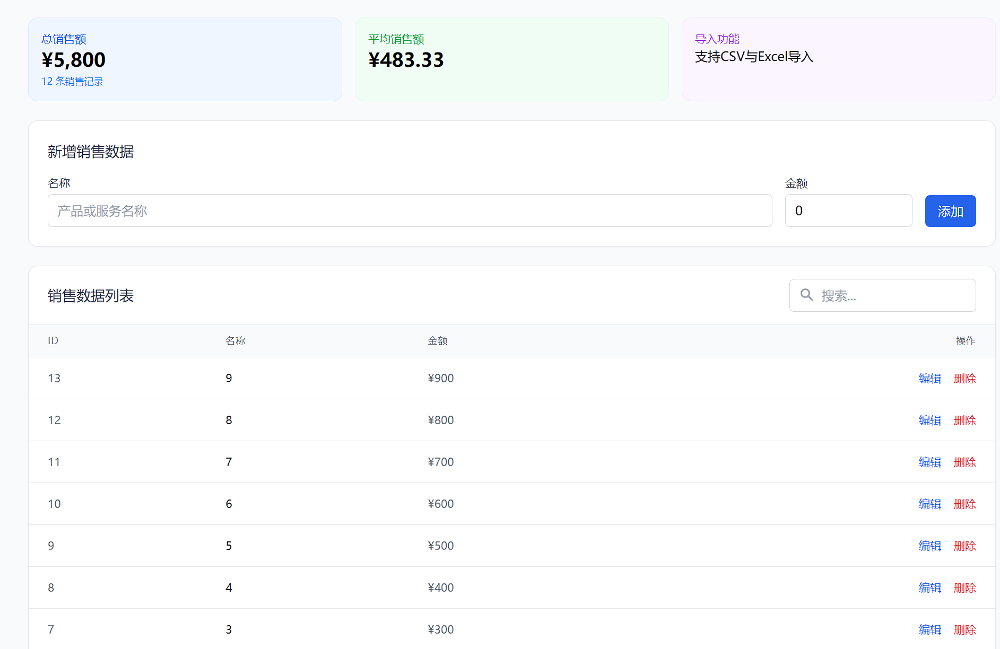
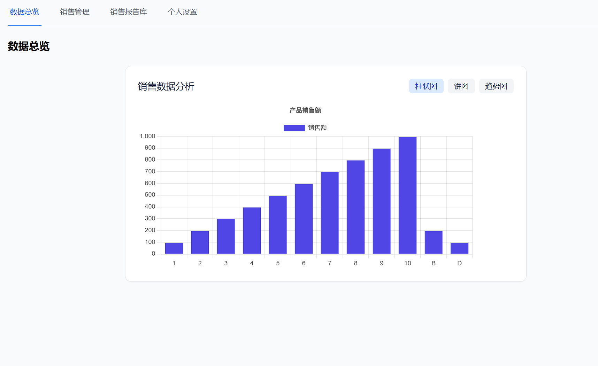

# Sales Data Analysis Platform

## Project Overview

This is an enterprise-grade sales data analysis platform built with Next.js and Supabase, designed for small teams and businesses. The platform provides sales data visualization, data import/export, file management, user permission controls, and other features to help teams manage and analyze sales data more efficiently.




*Read this in other languages: [中文](README.zh-CN.md)*

## Table of Contents

- [Features](#features)
- [Technology Stack](#technology-stack)
- [Project Structure](#project-structure)
- [Getting Started](#getting-started)
  - [Prerequisites](#prerequisites)
  - [Installation](#installation)
  - [Environment Variables](#environment-variables)
  - [Running the Project](#running-the-project)
- [Supabase Configuration](#supabase-configuration)
  - [Database Schema](#database-schema)
  - [Storage Setup](#storage-setup)
  - [RLS Policies](#rls-policies)
- [Usage Guide](#usage-guide)
- [Contributing](#contributing)
- [FAQ](#faq)
- [License](#license)

## Features

- **Intuitive Dashboard**
  - Real-time sales performance overview
  - Interactive charts and data visualization
  - Custom date range filters

- **Sales Data Management**
  - Add, edit, delete sales records
  - Category and tag management
  - Search and filter functionality

- **Data Import/Export**
  - Support for CSV/XLSX file imports
  - Batch data import preview and validation
  - Data export functionality

- **File Repository**
  - Sales reports and document storage
  - File categorization and search
  - File preview and download

- **User Management**
  - Role-based access control
  - Personal profile and settings

- **System Security**
  - Row-Level Security (RLS) policies
  - Secure authentication
  - Data access auditing

## Technology Stack

- **Frontend Framework**: [Next.js 15+](https://nextjs.org/) (App Router)
- **UI Framework**: [TailwindCSS](https://tailwindcss.com/)
- **Backend Services**: [Supabase](https://supabase.com/) (PostgreSQL, Auth, Storage)
- **Visualization**: [Chart.js](https://www.chartjs.org/) + React Chart.js 2
- **Data Processing**:
  - [XLSX](https://github.com/SheetJS/sheetjs) - Excel file processing
  - [date-fns](https://date-fns.org/) - Date formatting
- **File Handling**:
  - [react-file-icon](https://github.com/nkihrk/react-file-icon) - File icon display

## Project Structure

```
/
├── public/                 # Static assets
├── src/
│   ├── app/                # Main application directory (Next.js App Router)
│   │   ├── components/     # Reusable components
│   │   │   ├── Auth.tsx              # Authentication component
│   │   │   ├── DataImporter.tsx      # Data import component
│   │   │   ├── FileRepository.tsx    # File management component
│   │   │   ├── SalesChart.tsx        # Sales chart component
│   │   │   ├── SalesManager.tsx      # Sales data management component
│   │   │   ├── UserMenu.tsx          # User menu component
│   │   │   ├── UserProfile.tsx       # User profile component
│   │   │   └── fix-rls.sql           # RLS fix SQL script
│   │   │
│   │   ├── dashboard/      # Dashboard pages
│   │   │   ├── page.tsx             # Dashboard home page
│   │   │
│   │   │
│   │   ├── login/          # Login pages
│   │   ├── globals.css     # Global styles
│   │   ├── layout.tsx      # Root layout
│   │   └── page.tsx        # Home page
│   │
│   └── types/              # TypeScript type definitions
│
├── supabase/
│   └── migrations/         # Database migration scripts
│       └── 20240101000000_initial_schema.sql  # Initial schema
│
├── .env.example            # Example environment variables
├── next.config.js          # Next.js configuration
├── postcss.config.js       # PostCSS configuration
├── supabaseClient.ts       # Supabase client configuration
├── tailwind.config.js      # Tailwind configuration
└── package.json            # Project dependencies
```

## Getting Started

### Prerequisites

- **Node.js**: 18.0.0 or higher
- **npm** or **yarn** or **pnpm** package manager
- **Supabase** account and project

### Installation

1. **Clone the repository**

```bash
git clone https://github.com/yourusername/sales-data-platform.git
cd sales-data-platform
```

2. **Install dependencies**

Using npm:

```bash
npm install
```

Or using yarn:

```bash
yarn install
```

Or using pnpm:

```bash
pnpm install
```

### Environment Variables

1. Copy the example environment file

```bash
cp .env.example .env.local
```

2. Edit the `.env.local` file with your Supabase project URL and anon key (found in your Supabase project settings)

```
NEXT_PUBLIC_SUPABASE_URL=https://your-project-id.supabase.co
NEXT_PUBLIC_SUPABASE_ANON_KEY=your-anon-key
```

### Running the Project

For development:

```bash
npm run dev
# or
yarn dev
# or
pnpm dev
```

Open [http://localhost:3000](http://localhost:3000) to view the application.

## Supabase Configuration

### Database Schema

The project uses the following database tables:

#### 1. profiles Table - User Profiles

| Column | Type | Description |
|--------|------|-------------|
| id | uuid | Primary key, references auth.users |
| updated_at | timestamptz | Last updated timestamp |
| name | text | User's name |
| avatar_url | text | User's avatar URL |
| company | text | Company name |
| preferences | jsonb | User preferences |
| role | text | User role |

#### 2. sales Table - Sales Data

| Column | Type | Description |
|--------|------|-------------|
| id | uuid | Primary key |
| created_at | timestamptz | Creation timestamp |
| updated_at | timestamptz | Last updated timestamp |
| name | text | Sales item name |
| value | numeric | Sales amount |
| user_id | uuid | References user ID |
| category | text | Category (optional) |
| description | text | Description (optional) |

#### 3. files Table - File Records

| Column | Type | Description |
|--------|------|-------------|
| id | uuid | Primary key |
| created_at | timestamptz | Creation timestamp |
| name | text | File name |
| size | integer | File size in bytes |
| type | text | File MIME type |
| url | text | File URL |
| category | text | File category |
| user_id | uuid | References user ID |

### Storage Setup

The project uses two main storage buckets:

#### 1. uploads - File Upload Bucket

Used for storing user-uploaded sales reports and other document files.

#### 2. profiles - User Avatars Bucket

Used for storing user profile avatar images.

### RLS Policies

#### profiles Table Policies

```sql
-- Users can only read their own profiles
CREATE POLICY "Users can view their own profiles" 
ON public.profiles FOR SELECT USING (
  auth.uid() = id
);

-- Users can only update their own profiles
CREATE POLICY "Users can update their own profiles" 
ON public.profiles FOR UPDATE USING (
  auth.uid() = id
);
```

#### sales Table Policies

```sql
-- Users can only view their own sales data
CREATE POLICY "Users can view their own sales data" 
ON public.sales FOR SELECT USING (
  auth.uid() = user_id
);

-- Users can only insert their own sales data
CREATE POLICY "Users can insert their own sales data" 
ON public.sales FOR INSERT WITH CHECK (
  auth.uid() = user_id
);

-- Users can only update their own sales data
CREATE POLICY "Users can update their own sales data" 
ON public.sales FOR UPDATE USING (
  auth.uid() = user_id
);

-- Users can only delete their own sales data
CREATE POLICY "Users can delete their own sales data" 
ON public.sales FOR DELETE USING (
  auth.uid() = user_id
);
```

#### files Table Policies

```sql
-- Users can only view their own files
CREATE POLICY "Users can view their own files" 
ON public.files FOR SELECT USING (
  auth.uid() = user_id
);

-- Users can only insert their own files
CREATE POLICY "Users can insert their own files" 
ON public.files FOR INSERT WITH CHECK (
  auth.uid() = user_id
);

-- Users can only update their own files
CREATE POLICY "Users can update their own files" 
ON public.files FOR UPDATE USING (
  auth.uid() = user_id
);

-- Users can only delete their own files
CREATE POLICY "Users can delete their own files" 
ON public.files FOR DELETE USING (
  auth.uid() = user_id
);
```

#### Storage Policies

```sql
-- uploads bucket policies
-- Allow anyone to read files
CREATE POLICY "Anyone can read uploaded files" 
ON storage.objects FOR SELECT USING (
  (bucket_id = 'uploads')
);

-- Allow authenticated users to upload files
CREATE POLICY "Authenticated users can upload files" 
ON storage.objects FOR INSERT WITH CHECK (
  (bucket_id = 'uploads') AND (auth.role() = 'authenticated')
);

-- Allow users to delete their own files
CREATE POLICY "Users can delete their own files" 
ON storage.objects FOR DELETE USING (
  (bucket_id = 'uploads') AND (owner = auth.uid())
);
```

## Usage Guide

### 1. Registration/Login

- Visit the platform homepage
- Click the "Login" button to access the login page
- Choose to register with email or login directly
- Upon first login, a basic user profile will be created

### 2. Data Dashboard

- After login, you'll automatically enter the data dashboard page
- View sales data overview and charts
- Use the top tabs to switch between different features

### 3. Sales Data Management

- Click on the "Sales Management" tab
- View, add, edit, and delete sales data
- Use the search function to find specific data

### 4. Data Import

- Use the data import feature in the sales management page
- Upload CSV or XLSX format files
- Preview data before confirming import

### 5. File Management

- Click on the "Sales Reports Library" tab
- Upload, categorize, and manage sales-related files
- Preview and download uploaded files

### 6. Personal Settings

- Click on the "Personal Settings" tab
- Update personal profile and system preferences
- Modify password and other security settings


## Contributing

1. Fork the repository
2. Create a feature branch (`git checkout -b feature/amazing-feature`)
3. Commit your changes (`git commit -m 'Add some amazing feature'`)
4. Push to the branch (`git push origin feature/amazing-feature`)
5. Open a Pull Request

## FAQ

### Q: How do I fix permission errors?

A: If you encounter RLS permission errors, you can use the provided SQL fix script. Execute the SQL commands in the `src/app/components/fix-rls.sql` file in the Supabase SQL Editor.

### Q: How do I reset my password?

A: Use the "Forgot password" option on the login page. Enter your email and you will receive a password reset email.

### Q: What file formats are supported for data import?

A: Currently, CSV and XLSX (Excel) formats are supported. Files must contain at least the 'name' and 'value' columns.

## License

This project is licensed under the MIT License - see the [LICENSE](LICENSE) file for details.
