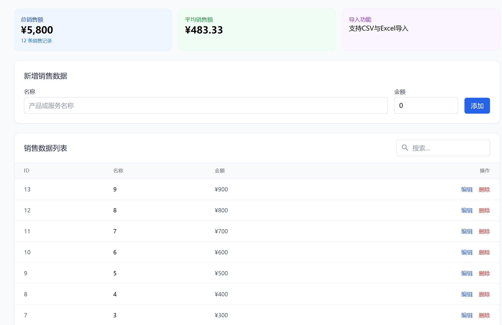
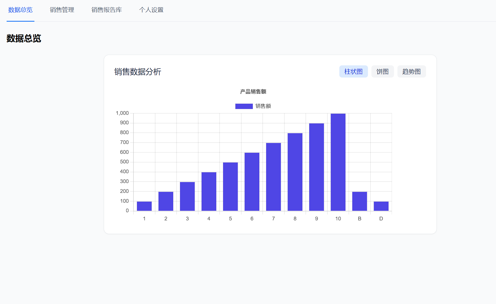

# 销售数据分析平台

## 项目概述

这是一个基于Next.js和Supabase构建的企业级销售数据分析平台，专为小型团队和企业打造。本平台提供了销售数据可视化、数据导入导出、文件管理、用户权限控制等功能，帮助团队更高效地管理和分析销售数据。




## 目录

- [功能特点](#功能特点)
- [技术栈](#技术栈)
- [项目结构](#项目结构)
- [快速开始](#快速开始)
  - [环境要求](#环境要求)
  - [安装步骤](#安装步骤)
  - [环境变量配置](#环境变量配置)
  - [启动项目](#启动项目)
- [Supabase配置](#supabase配置)
  - [数据库表结构](#数据库表结构)
  - [存储配置](#存储配置)
  - [RLS权限策略](#rls权限策略)
- [使用指南](#使用指南)
- [贡献指南](#贡献指南)
- [常见问题解答](#常见问题解答)
- [许可证](#许可证)

## 功能特点

- **直观的数据仪表盘**
  - 销售业绩实时概览
  - 可交互图表和数据展示
  - 自定义时间范围筛选

- **销售数据管理**
  - 添加、编辑、删除销售记录
  - 分类和标签管理
  - 搜索和过滤功能

- **数据导入导出**
  - 支持 CSV/XLSX 文件导入
  - 批量数据导入预览和验证
  - 数据导出功能

- **文件仓库**
  - 销售报告和文档存储
  - 文件分类和搜索
  - 文件预览和下载

- **用户管理**
  - 基于角色的权限控制
  - 个人资料和设置

- **系统安全**
  - 行级安全策略(RLS)
  - 安全的身份验证
  - 数据访问审计

## 技术栈

- **前端框架**：[Next.js 15+](https://nextjs.org/) (App Router)
- **UI框架**：[TailwindCSS](https://tailwindcss.com/)
- **后端服务**：[Supabase](https://supabase.com/) (PostgreSQL, Auth, Storage)
- **可视化**：[Chart.js](https://www.chartjs.org/) + React Chart.js 2
- **数据处理**：
  - [XLSX](https://github.com/SheetJS/sheetjs) - Excel文件处理
  - [date-fns](https://date-fns.org/) - 日期格式化
- **文件处理**：
  - [react-file-icon](https://github.com/nkihrk/react-file-icon) - 文件图标展示

## 项目结构

```
/
├── public/                 # 静态资源
├── src/
│   ├── app/                # 应用主目录 (Next.js App Router)
│   │   ├── components/     # 可复用组件
│   │   │   ├── Auth.tsx              # 认证组件
│   │   │   ├── DataImporter.tsx      # 数据导入组件
│   │   │   ├── FileRepository.tsx    # 文件管理组件
│   │   │   ├── SalesChart.tsx        # 销售图表组件
│   │   │   ├── SalesManager.tsx      # 销售数据管理组件
│   │   │   ├── UserMenu.tsx          # 用户菜单组件
│   │   │   ├── UserProfile.tsx       # 用户个人资料组件
│   │   │   └── fix-rls.sql           # RLS修复SQL脚本
│   │   │
│   │   ├── dashboard/      # 仪表板页面
│   │   │   ├── page.tsx             # 仪表板主页
│   │   │
│   │   │
│   │   ├── login/          # 登录页面
│   │   ├── globals.css     # 全局样式
│   │   ├── layout.tsx      # 根布局
│   │   └── page.tsx        # 首页
│   │
│   └── types/              # TypeScript类型定义
│
├── supabase/
│   └── migrations/         # 数据库迁移脚本
│       └── 20240101000000_initial_schema.sql  # 初始架构
│
├── .env.example            # 环境变量示例
├── next.config.js          # Next.js 配置
├── postcss.config.js       # PostCSS 配置
├── supabaseClient.ts       # Supabase 客户端配置
├── tailwind.config.js      # Tailwind 配置
└── package.json            # 项目依赖
```

## 快速开始

### 环境要求

- **Node.js**: 18.0.0 或更高版本
- **npm** 或 **yarn** 或 **pnpm** 包管理工具
- **Supabase** 账号和项目

### 安装步骤

1. **克隆仓库**

```bash
git clone https://github.com/yourusername/sales-data-platform.git
cd sales-data-platform
```

2. **安装依赖**

使用 npm:

```bash
npm install
```

或使用 yarn:

```bash
yarn install
```

或使用 pnpm:

```bash
pnpm install
```

### 环境变量配置

1. 复制环境变量示例文件

```bash
cp .env.example .env.local
```

2. 编辑 `.env.local` 文件，填入您的 Supabase 项目 URL 和匿名密钥，可在 Supabase 项目设置中找到

```
NEXT_PUBLIC_SUPABASE_URL=https://your-project-id.supabase.co
NEXT_PUBLIC_SUPABASE_ANON_KEY=your-anon-key
```

### 启动项目

开发环境运行:

```bash
npm run dev
# 或
yarn dev
# 或
pnpm dev
```

打开 [http://localhost:3000](http://localhost:3000) 查看应用。

## Supabase配置

### 数据库表结构

项目使用以下数据表结构：

#### 1. profiles 表 - 用户资料

| 列名 | 类型 | 说明 |
|------|------|------|
| id | uuid | 主键，关联 auth.users |
| updated_at | timestamptz | 更新时间 |
| name | text | 用户姓名 |
| avatar_url | text | 用户头像URL |
| company | text | 公司名称 |
| preferences | jsonb | 用户偏好设置 |
| role | text | 用户角色 |

#### 2. sales 表 - 销售数据

| 列名 | 类型 | 说明 |
|------|------|------|
| id | uuid | 主键 |
| created_at | timestamptz | 创建时间 |
| updated_at | timestamptz | 更新时间 |
| name | text | 销售项目名称 |
| value | numeric | 销售金额 |
| user_id | uuid | 关联用户ID |
| category | text | 分类(可选) |
| description | text | 描述(可选) |

#### 3. files 表 - 文件记录

| 列名 | 类型 | 说明 |
|------|------|------|
| id | uuid | 主键 |
| created_at | timestamptz | 创建时间 |
| name | text | 文件名称 |
| size | integer | 文件大小(字节) |
| type | text | 文件MIME类型 |
| url | text | 文件URL |
| category | text | 文件分类 |
| user_id | uuid | 关联用户ID |

### 存储配置

项目使用两个主要的存储桶:

#### 1. uploads - 文件上传存储桶

用于存储用户上传的销售报告和其他文档文件。

#### 2. profiles - 用户头像存储桶

用于存储用户个人头像图片。

### RLS权限策略

#### profiles 表策略

```sql
-- 用户只能读取自己的资料
CREATE POLICY "用户可以查看自己的资料" 
ON public.profiles FOR SELECT USING (
  auth.uid() = id
);

-- 用户只能更新自己的资料
CREATE POLICY "用户可以更新自己的资料" 
ON public.profiles FOR UPDATE USING (
  auth.uid() = id
);
```

#### sales 表策略

```sql
-- 用户只能查看自己的销售数据
CREATE POLICY "用户可以查看自己的销售数据" 
ON public.sales FOR SELECT USING (
  auth.uid() = user_id
);

-- 用户只能插入自己的销售数据
CREATE POLICY "用户可以添加自己的销售数据" 
ON public.sales FOR INSERT WITH CHECK (
  auth.uid() = user_id
);

-- 用户只能更新自己的销售数据
CREATE POLICY "用户可以更新自己的销售数据" 
ON public.sales FOR UPDATE USING (
  auth.uid() = user_id
);

-- 用户只能删除自己的销售数据
CREATE POLICY "用户可以删除自己的销售数据" 
ON public.sales FOR DELETE USING (
  auth.uid() = user_id
);
```

#### files 表策略

```sql
-- 用户只能查看自己的文件
CREATE POLICY "用户可以查看自己的文件" 
ON public.files FOR SELECT USING (
  auth.uid() = user_id
);

-- 用户只能插入自己的文件
CREATE POLICY "用户可以添加自己的文件" 
ON public.files FOR INSERT WITH CHECK (
  auth.uid() = user_id
);

-- 用户只能更新自己的文件
CREATE POLICY "用户可以更新自己的文件" 
ON public.files FOR UPDATE USING (
  auth.uid() = user_id
);

-- 用户只能删除自己的文件
CREATE POLICY "用户可以删除自己的文件" 
ON public.files FOR DELETE USING (
  auth.uid() = user_id
);
```

#### storage 策略

```sql
-- uploads 存储桶策略
-- 允许所有人读取文件
CREATE POLICY "允许所有人读取文件" 
ON storage.objects FOR SELECT USING (
  (bucket_id = 'uploads')
);

-- 允许已登录用户上传文件
CREATE POLICY "允许已登录用户添加文件" 
ON storage.objects FOR INSERT WITH CHECK (
  (bucket_id = 'uploads') AND (auth.role() = 'authenticated')
);

-- 允许用户删除自己的文件
CREATE POLICY "允许用户删除自己的文件" 
ON storage.objects FOR DELETE USING (
  (bucket_id = 'uploads') AND (owner = auth.uid())
);
```

## 使用指南

### 1. 注册/登录

- 访问平台首页
- 点击"登录"按钮进入登录页面
- 可选择使用邮箱注册或直接登录
- 首次登录后会创建基本用户资料

### 2. 数据仪表盘

- 登录后会自动进入数据仪表盘页面
- 查看销售数据概览和图表
- 使用顶部标签页在不同功能间切换

### 3. 销售数据管理

- 点击"销售管理"标签页
- 查看、添加、编辑和删除销售数据
- 使用搜索功能查找特定数据

### 4. 数据导入

- 在销售管理页面中使用数据导入功能
- 上传CSV或XLSX格式文件
- 预览数据后确认导入

### 5. 文件管理

- 点击"销售报告库"标签页
- 上传、分类、管理销售相关文件
- 预览和下载已上传文件

### 6. 个人设置

- 点击"个人设置"标签页
- 更新个人资料和系统偏好
- 修改密码和其他安全设置


## 贡献指南

1. Fork本仓库
2. 创建特性分支 (`git checkout -b feature/amazing-feature`)
3. 提交更改 (`git commit -m 'Add some amazing feature'`)
4. 推送到分支 (`git push origin feature/amazing-feature`)
5. 创建Pull Request

## 常见问题解答

### Q: 如何修复权限错误?

A: 如果遇到RLS权限错误，可以使用项目中提供的SQL修复脚本。在Supabase SQL编辑器中执行`src/app/components/fix-rls.sql`文件中的SQL命令。

### Q: 如何重置密码?

A: 通过登录页面的"忘记密码"选项，输入邮箱后会收到密码重置邮件。

### Q: 数据导入支持哪些格式?

A: 目前支持CSV和XLSX(Excel)格式，文件中必须包含name和value列。

## 许可证

本项目基于MIT许可证开源 - 查看[LICENSE](LICENSE)文件了解详情。 